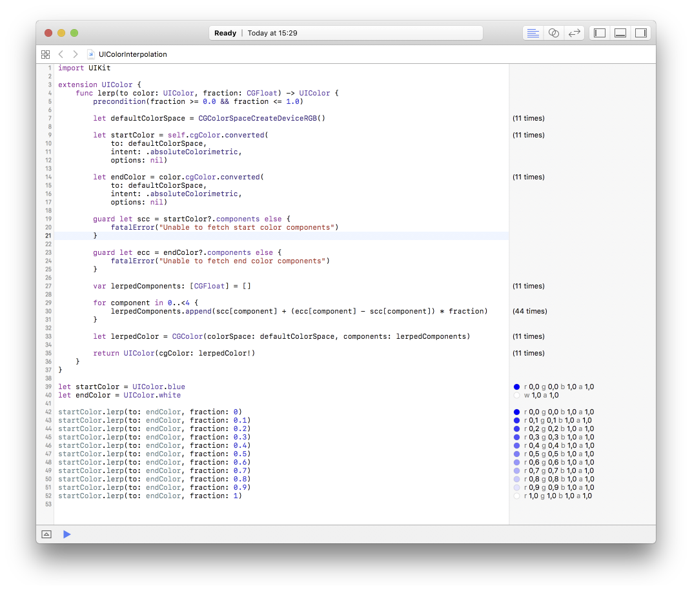

# UIColor Interpolation
A playground showing the linear interpolation between colors, including the ones that are defined in different colour spaces.

See the [source code](https://github.com/georgmay/UIColor-Interpolation/blob/master/UIColorInterpolation.playground/Contents.swift) for details.

## Playground

The playground includes the following examples for exploring practical applications of the extension. Note that Xcode 7.3 or later is required for interactivity.

## Basic Usage

It's a simple visualized example of how does interpolation works.

